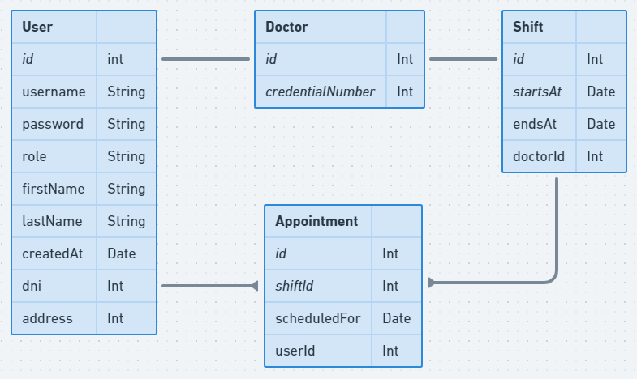
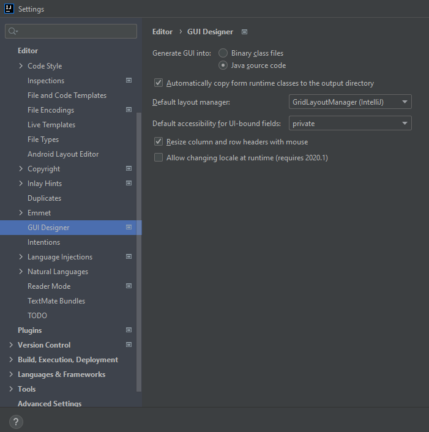
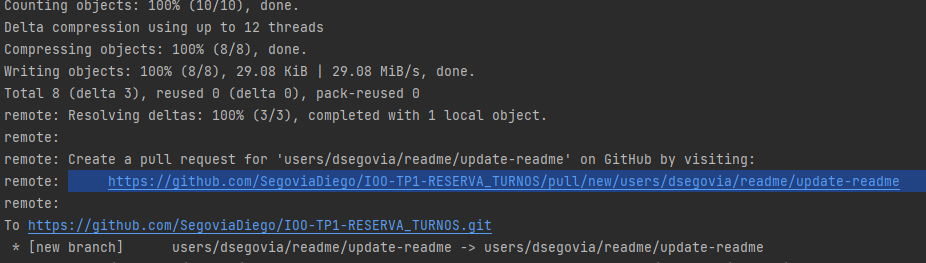
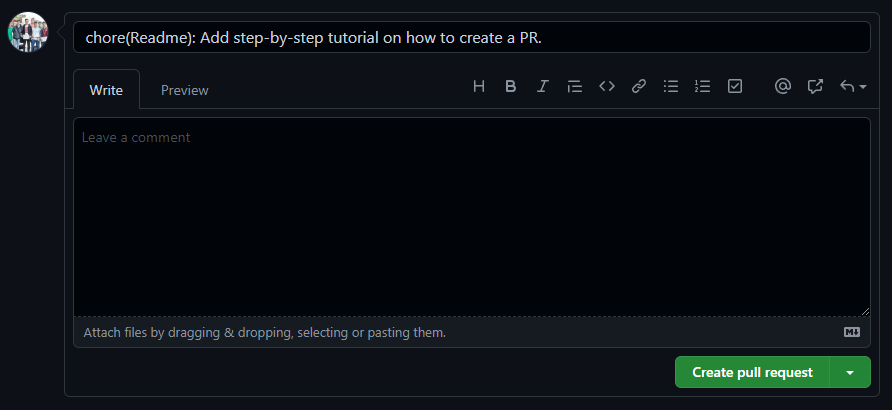

# IOO-TP1-RESERVA_TURNOS
TP 1 de Introducción a la orientación a objetos - Sistema para la reserva de turnos

# DER
!

# Setup

* Clonar el proyecto
* En Settings -> GUI Designer
  * Seleccionar "Generate GUI into: Java source code"
  

# Subir un cambio al repo
Parate en la consola de tu IDE y seguí estos pasos:
* Ejecuta el comando `git checkout -b nombre-de-tu-branch`
  * Entre las comillas vas a escribir el nombre de tu branch, por ejemplo: `new-login-page`
* Ejecuta el comando `git add .`
* Ejecuta el comando `git commit -m "Titulo de tu cambio"`.
  * Entre las comillas vas a escribir una breve descripción de tu cambio, por ejemplo: `"Nueva pantalla de login"`
* Ejecuta el comando `git push -u origin nombre-de-tu-branch`
  * En `nombre-de-tu-branch` vas a escribir la branch en la que estas trabajando, por ejemplo: `new-login-page`'
* La consola te va a mostrar un link donde podes hacer click para ir a crear el PR.
  * Ejemplo:
  * 
* Hacer click en "Create Pull Request"
  * 
* Una vez creado el PR, podes pedir en el grupo de WhatsApp que alguien le pegue una mirada y le de merge!